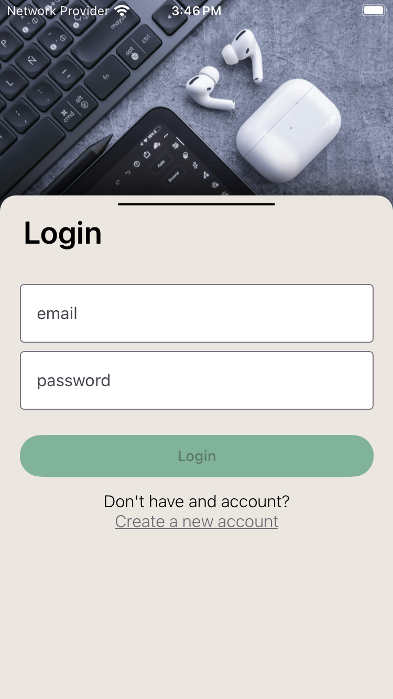
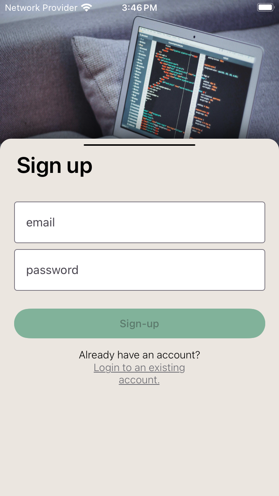
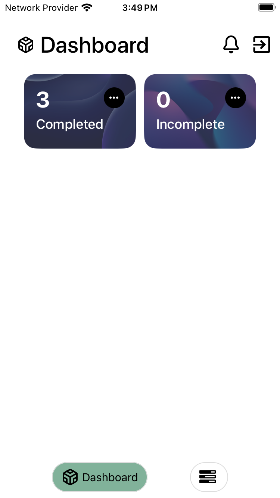
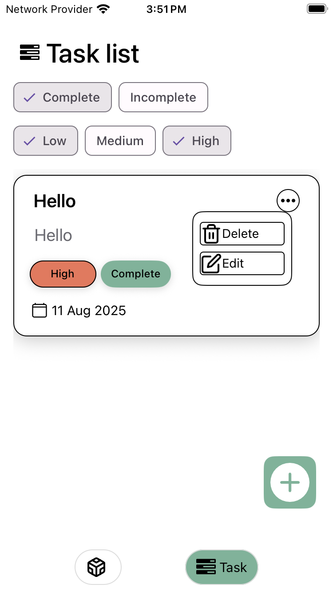

# Gig Task Manager (React Native · Expo · Firebase)

A simple task manager for gig workers built for the WhatBytes assignment. It includes email/password auth, per‑user Firestore storage, create/delete/toggle of tasks, multi‑select filtering by status & priority, sorting by due date (earliest → latest), and a clean, responsive UI following Material guidelines.

> **State management note (re: BLoC/Riverpod requirement)**  
> The brief mentions BLoC/Riverpod (Flutter ecosystems). In React Native, this app uses **Redux Toolkit (RTK)** with typed slices and async thunks, which provides the same architectural goals: unidirectional data flow, predictable state transitions, and clear separation between UI and data layers.

---

## Gif Demo

<p align="center">
  
</p>

---

## Screenshots

<p align="center">
  
  
</p>
<p align="center">
  
  
</p>

---

## Features

- **Auth**: Firebase email/password (sign up, sign in, logout) with error display.
- **Tasks (per user)**:
  - Create new task (title, description, due date, priority).
  - Delete task with confirm.
  - Toggle **completed / incomplete**.
  - Read tasks stored under `users/{uid}/tasks` in Firestore.
- **Filtering & sorting**:
  - Multi‑select filters via chips:
    - Status: Completed / Incomplete (can select both).
    - Priority: Low / Medium / High (any combination).
  - Semantics: **empty set = all**; **OR** within each axis; **AND** across axes.
  - List is **sorted by due date asc** (earliest→latest) after filtering.
- **UI/UX**:
  - React Native Paper components, responsive sizing, light/dark aware theme using a shared color palette.
  - Custom bottom tabs, Add Task presented as a modal/sheet.

### Not in scope (time-boxed)

- **Edit Task screen** (prefilled form for updating title/description/priority/date). The update thunk exists but UI is deferred.
- **Offline persistent cache**. (Firestore is configured for reliability; full local persistence via `redux-persist` can be added later.)

---

## Tech Stack

- **React Native** (Expo prebuild)
- **Redux Toolkit** (slices + thunks, typed hooks)
- **Firebase Web SDK** (Auth, Firestore)
- **React Navigation** (stack + custom bottom tabs)
- **React Native Paper** (Material UI)
- **Responsive helpers** (`react-native-responsive-screen`)

---

## Project Structure (high level)

```
src/
  component/        # Reusable UI (CustomTextInput, CustomButton, Chips, TaskItems, etc.)
  constant/         # Colors, Size (spacing/radius/font), responsive helpers
  navigation/       # Root stacks, BottomTabs with custom tab bar, AddTask modal on stack
  screen/           # Screens: Login, Signup, Dashboard, Task, AddTask
  store/
    feature/
      auth/         # authSlice + thunks + extra reducers
      tasks/        # tasksSlice + thunks + extra reducers
  libs/             # firebase.ts (Auth + Firestore init)
  models/           # Type definitions (AuthUser, Task, TaskEntity, Priority)
  utils/            # formatters (e.g., formatDueDate)
```

---

## Data Model

- `Task` fields: `id`, `title`, `description`, `dueDate`, `priority ('low'|'medium'|'high')`, `completed`, `createdAt`, `updatedAt`.
- In Redux, dates are stored as **ISO strings** (`TaskEntity`) to keep state serializable (no Redux warnings). They’re converted to `Date` at render.
- Firestore paths:
  - User document: `/users/{uid}`
  - Tasks subcollection: `/users/{uid}/tasks/{taskId}`

### Firestore Security Rules

```rules
rules_version = '2';
service cloud.firestore {
  match /databases/{database}/documents {
    match /users/{uid} {
      allow read, write: if request.auth != null && request.auth.uid == uid;
      match /tasks/{taskId} {
        allow read, write: if request.auth != null && request.auth.uid == uid;
      }
    }
  }
}
```

---

## Setup & Running

### Prereqs

- Node **18–20** recommended.
- Xcode (for iOS) / Android SDK (for Android).
- A Firebase project with Web API keys (Auth + Firestore enabled).

### 1) Configure Firebase

Edit `src/libs/firebase.ts` with your project config:

```ts
const firebaseConfig = {
  apiKey: "…",
  authDomain: "…",
  projectId: "…",
  storageBucket: "…",
  messagingSenderId: "…",
  appId: "…",
};
```

### 2) Install & run (dev)

```bash
npm install
# iOS/Android native projects
npx expo prebuild
# run on device/emulator
npx run pods
npx run clean_android

npx expo run:ios
npx expo run:android

# or dev server (Metro)
npx expo start
```

### 3) Build release (APK)

- With EAS: `eas build -p android` (configure once)
- Or Android Studio/Gradle inside `android/`

---

## Usage Notes

- **Auth**: Create an account on the Signup screen; login persists via Firebase Auth.
- **Add Task**: Open the plus/add button → modal sheet → fill title, description, date, priority → Confirm.
- **Delete**: Use the `…` menu on a task → Delete (confirm).
- **Toggle Complete**: Quick toggle available on each task row.

---

## Design & Theming

- Color palette: `#F4F1DE`, `#E07A5F`, `#3D405B`, `#81B29A`, `#F2CC8F`
- Light/Dark theme values are centralized in `src/constant/Colors.ts` with usage comments.
- Spacing, radius, and font scale live in `src/constant/Size.ts`.

---

## Roadmap (if extended)

- Edit Task screen (update title/description/priority/date).
- `redux-persist` for `tasks` slice to fulfill stronger “local storage”/offline UX.
- Unit tests for thunks/selectors and basic UI tests.
- Accessibility & polish.

---

## License

Private assignment project for WhatBytes recruiting. Do not redistribute.
